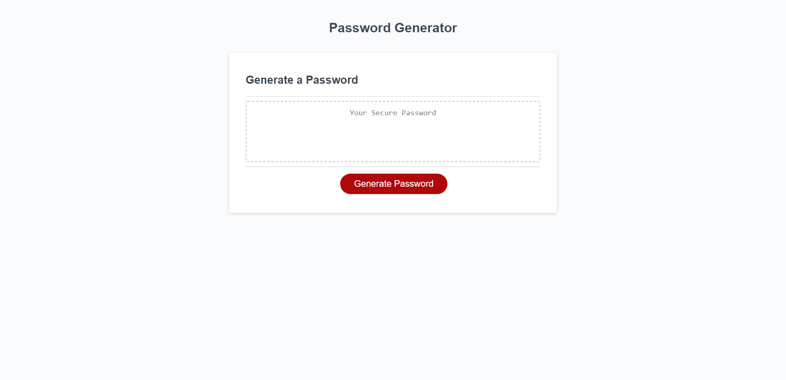
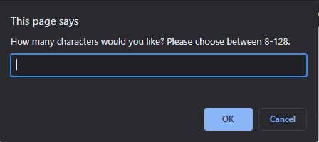
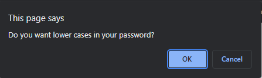
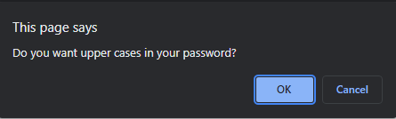

# Random Password Generator

## Description

An simple javascript application that a user can use to generate a random password based on criteria they’ve selected.

**Link to Deployed Application:** [https://aldrinburgos18.github.io/Random-Password-Generator/](https://aldrinburgos18.github.io/Random-Password-Generator/)

## Table of Contents

- [Installation](#installation)
- [Screenshots](#screenshots)
- [Contributing](#contributing)
- [Questions](#questions)
- [License](#license)
- [Technologies Used](#technologies-used)

## Installation

No installation needed.

## Screenshots

This is what the landing page looks like:

The user can choose the length of their password:  

The user can select the type of characters they want in their password:  
   

## Contributing

When contributing to this repository, please first discuss the change you wish to make via issue, email, or any other method with the owners of this repository before making a change.

## Questions

If you have any additional questions, please feel free to contact me at:  
E-mail: burgos.aldrin@gmail.com  
Github: [aldrinburgos18](https://github.com/aldrinburgos18)

## License

  
A short and simple permissive license with conditions only requiring preservation of copyright and license notices. Licensed works, modifications, and larger works may be distributed under different terms and without source code.  
_[More Information about this license...](https://opensource.org/licenses/MIT)_

## Technologies Used

-HTML  
-CSS  
-Javascript

